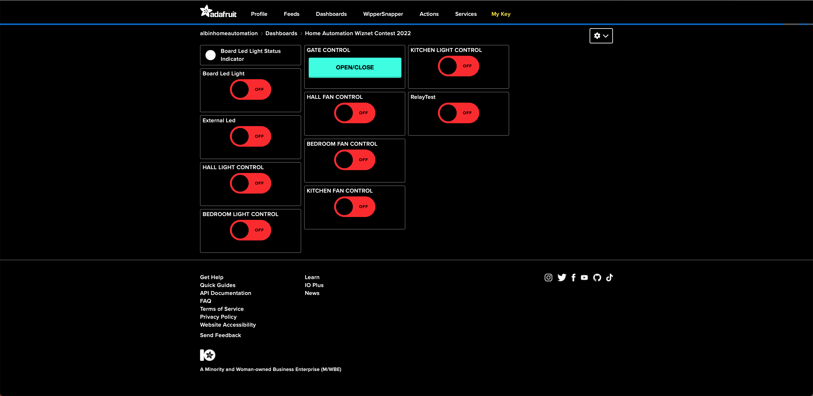

# Home Automation using the Wiznet W5500-EVB-Pico for the Wiznet-Contest-2022

  

<b>YOUTUBE LINK:- </b>
[Wiznet Contest 2022 | How to create Smart Home Automation using W5100S](https://www.youtube.com/watch?v=o0HWjFaj6sY)
 

- To get the latest version of circuit python click [here](https://downloads.circuitpython.org/bin/raspberry_pi_pico/en_GB/adafruit-circuitpython-raspberry_pi_pico-en_GB-7.2.5.uf2) file,to flash drop the file on to the board after pressing the button and connecting to usb.

- TO RESET THE BOARD NUKE IT with the flash_nuke.uf2 file from [here](https://github.com/The-Tech-Troll-Tube/Wiznet-Contest-2022/raw/main/flash_nuke.uf2), to flash drop the file on to the board after pressing the button and connecting to usb.

- Copy content from CIRCUIT-PY Folder to you circuit python flashed Wiznet W5500-EVB-Pico.

- Edit the secrets.py file with you credentials from Adafruit IO.

- Create the a dashboard in Adafruit IO as shown in the Image below:-
 

  

<h4> LINK TO MAIN PROJECT </h4>
- <b> Please do like my project and drop your comments in the actual project link by clicking this link below  
              https://maker.wiznet.io/2022/01/12/smart-home-control-system/</b>
  
      
  
  Thanks and have a great day!
